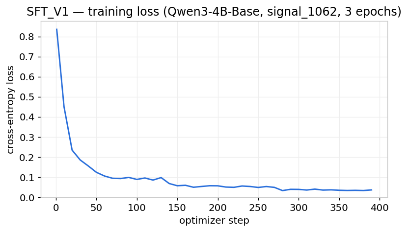
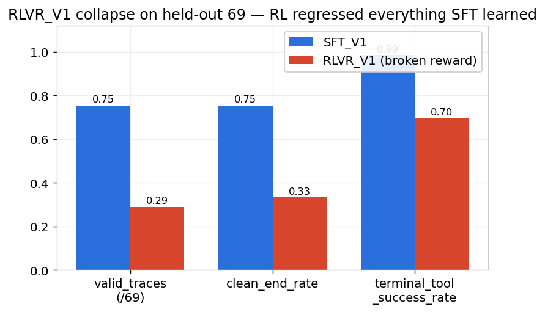
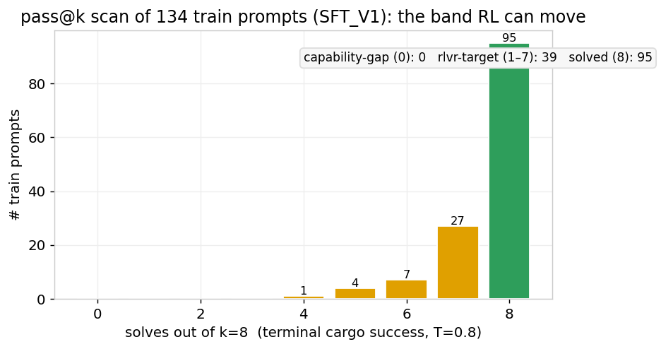
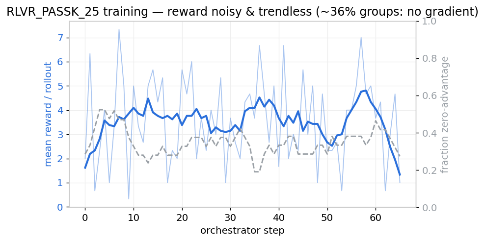
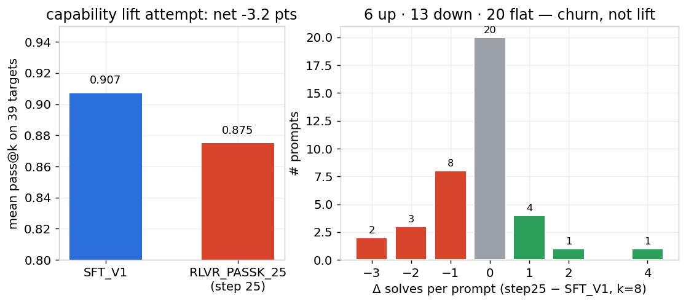

# SFT → RLVR for a Rust tool-use agent: where supervised learning ends and RL begins

Teaching `Qwen3-4B-Base` to be a coding agent on real Rust tasks — and then running the experiment that most write-ups skip: *does reinforcement learning actually add
anything on top of a good SFT model, and how do you tell before you burn the GPUs?*

The short version: SFT taught the protocol and the skill cleanly. Every RL run after
that **regressed**. That sounds like failure, but the interesting part is *why* it was
predictable — and the one cheap measurement (`pass@k`) that called it in advance. This
is a negative result with a clean mechanism, which is more useful than a lucky curve.

The model speaks a tiny tool-use protocol:

```text
assistant ->  CALL read_file(id="c1", file_path="src/lib.rs")
tool      ->  RESULT c1: status: success  stdout: ...
assistant ->  CALL apply_patch(id="c2", ...)
tool      ->  RESULT c2: status: success  stdout: patch applied
assistant ->  CALL cargo_run(id="c3", project_path=".")
tool      ->  RESULT c3: status: success  stdout: ada:4,bob:2,cy:8
assistant ->  FINAL: patched the filter pipeline; stdout now matches.
```

Tools execute **for real** against sandboxed crates. `cargo_run` only counts as success
if stdout exactly matches the oracle; `cargo_test` only if the tests pass. There is no
reward model to fool — the verifier is a compiler.

---

## 1. The stack: PRIME-RL and `verifiers`, in plain terms

Because the whole project runs on [PRIME-RL](https://github.com/PrimeIntellect-ai/prime-rl)
and [`verifiers`](https://github.com/willccbb/verifiers), here's the mental model you
need before any of the results make sense.

### `verifiers` — the environment and the reward

`verifiers` is the library that defines *what a rollout is* and *how it's scored*. Two
pieces matter:

- **`MultiTurnEnv`** — a multi-turn environment. You implement two methods:
  - `env_response(messages, state)` — given what the model just produced, return the
    next non-assistant turn. In our case: parse a `CALL`, **execute the real cargo tool**,
    and hand back a `RESULT` block.
  - `is_completed(state)` — decide when the episode ends (no pending calls left, or the
    tool-round budget is exhausted).
- **`Rubric`** — a bag of reward functions, each with a weight. The episode's scalar
  reward is the weighted sum. Ours has exactly one: `_rust_tool_reward` at weight 1.0.

Our environment, `rl/task_trace.py::RustToolEnv`, subclasses `MultiTurnEnv`. The loop is
exactly the protocol above: model emits `CALL` → `env_response` copies the crate into a
fresh per-rollout sandbox, runs `cargo`, formats the `RESULT` → repeat until `FINAL` or
the 15-round cap.

```python
class RustToolEnv(vf.MultiTurnEnv):
    async def env_response(self, messages, state):
        calls = parse_call_blocks(latest_assistant(state))      # CALL tool(id=..., ...)
        result = execute_rust_tool(self.executor, call.tool, call.params)  # real cargo
        return [{"role": "tool", "content": format_result_block(call.id, result)}]

    async def is_completed(self, state):
        return no_pending_calls(state) or rounds_used >= self.max_tool_rounds

rubric = vf.Rubric(parser=parser)
rubric.add_reward_func(_rust_tool_reward, weight=1.0)   # one scalar per rollout
```

This is **RLVR** — *RL with Verifiable Rewards*. The reward isn't a learned preference
model; it's the ground-truth output of a verifier (tests pass / stdout matches). That
makes the signal uncheatable but **sparse and binary**: you mostly get +8 or nothing.
Hold that thought — it's the whole story later.

### PRIME-RL — the asynchronous training loop

PRIME-RL splits RL into three processes that run concurrently, talking over the
filesystem:

```
                 weights (filesystem broadcast)
   ┌──────────┐  ───────────────────────────►  ┌─────────────┐
   │ TRAINER  │                                 │  INFERENCE  │  vLLM, serves
   │ (FSDP,   │                                 │  (policy)   │  the current policy
   │  GRPO)   │  ◄───────────────────────────   └─────────────┘
   └──────────┘   training batches (rollouts)          │ generates rollouts
        ▲                                               ▼
        │                                        ┌──────────────┐
        │                                        │ ORCHESTRATOR │  runs the verifiers
        └──── KL anchor ◄──── ┌─────────┐        │  env, scores │  env, applies the
                              │ TEACHER │ ◄───── │  & filters   │  rubric, filters
                              │ (frozen │        └──────────────┘
                              │  vLLM)  │
                              └─────────┘
```

- **Orchestrator** drives the `verifiers` environment: it asks the inference engine for
  completions, runs the multi-turn tool loop, scores each rollout with the rubric, and
  assembles training batches. It also runs the **rollout filters**.
- **Trainer** does the policy-gradient update (GRPO) under FSDP, then **broadcasts the
  new weights** to the inference engine so the next rollouts are on-policy.
- **Inference** is a vLLM server holding the current policy.
- **Teacher** is a second, *frozen* vLLM server (here it's SFT_V1 itself). The trainer
  adds a KL penalty pulling the policy toward the teacher's distribution — the **anchor**
  that stops RL from wandering off a cliff.

### GRPO and the zero-advantage filter (the load-bearing concept)

PRIME-RL uses **GRPO** (Group Relative Policy Optimization). For each prompt it samples a
*group* of `G` rollouts (we used 8, then 16), scores each, and computes the advantage of
rollout *i* by normalizing within its own group:

```
A_i = (r_i − mean(r_group)) / std(r_group)
```

No value network — the group's own mean is the baseline. This has a brutal consequence:

> **If every rollout in a group gets the same reward, `std = 0`, every advantage is 0,
> and the group contributes no gradient.**

PRIME-RL makes this explicit with the **`zero_advantage` filter** (enforced in
`rl/configs/task_trace/orchestrator.toml`): groups where all rollouts scored identically
are dropped before the trainer ever sees them. This is efficient — but it also means
**a prompt the model already solves every time, or fails every time, teaches RL nothing.**
The only prompts that produce a gradient are the ones with *within-group variance*: some
rollouts pass, some don't. Remember this; it is the entire reason this project ended the
way it did.

---

## 2. SFT: teaching the protocol works

SFT_V1 is `Qwen3-4B-Base` fine-tuned on `signal_1062` — 1062 synthetic-but-real traces
(GPT-authored task specs → materialized into actual crates → kept only if real tool
execution matched the intended trajectory). Assistant-only loss masking, 3 epochs.



On the 69 held-out prompts SFT_V1 is genuinely good at the *hard* part — solving:

| metric | SFT_V1 | what it means |
|---|---|---|
| `terminal_tool_success` | **0.986** | reaches a passing verifier on 68/69 |
| `valid_traces` | 52 / 69 | solved **and** stopped cleanly |
| `clean_end_rate` | 0.754 | emitted `FINAL` right after the last tool |

A real rollout, scored +8 by the verifier (4 turns, no wasted moves):

```text
CALL read_file(id="c1", file_path=".../src/main.rs")
RESULT c1: status: success  stdout: fn main() { let records = [("ada", Some(4)), ...
CALL apply_patch(id="c2", find=".filter(|entry| ...", replace=".filter_map(|(name, score)| ...")
RESULT c2: status: success  stdout: patch applied
CALL cargo_run(id="c3", project_path=".")
RESULT c3: status: success  stdout: ada:4,bob:2,cy:8        ← exact oracle match
FINAL: patched the filter pipeline; stdout now matches.
```

The model reads, forms a hypothesis, patches, **verifies against the real compiler**, and
stops. That's the capability SFT installed, and it's solid.

### The one persistent gap: stopping

The 0.99-vs-0.75 gap is one failure mode: the model **solves, then keeps going**. It
reaches a passing `cargo_test`, then patches again, and again, until it hits the 15-round
cap and the trace ends on a bare `<|im_start|>assistant` with no `FINAL`. We threw data at
it — `signal_v2` (variable-depth recovery) and `signal_v3` (deeper coverage, oversampled
clean `PASS→FINAL` endings):

| model | data | valid | clean_end | terminal |
|---|---|---|---|---|
| SFT_V1 | signal_1062 (depth-1 recovery) | 52 | 0.754 | 0.986 |
| SFT_V2 | + variable-depth recovery | 48 | 0.70 | 0.96 |
| SFT_V3 | + deep coverage, oversample clean | 50 | 0.725 | 0.99 |

Stopping **plateaued at 0.72–0.75** regardless. More recovery data even made it
*over-recover* (5 failed attempts where V1 fixed it in 1). So we asked the obvious
question: **is stopping an RL problem?**

---

## 3. Experiment 1 — RL to teach stopping, and how it collapsed

`RLVR_V1` was the first attempt: shape a reward that punishes churning past a success and
rewards the clean `FINAL`. It used a stacked-penalty reward, `teacher-tau 0.01` (almost no
anchor), and cut exploration (temp 0.8→0.6, rollouts 8→4). The result was not a small
regression — it was a **collapse of capability the reward never even mentioned**:



```
held-out 69:  valid 52 → 20   clean_end 0.75 → 0.33   terminal 0.99 → 0.70   task_failure 1 → 21
```

The model got *worse at solving*, which the reward never touched. Post-mortem — four
textbook GRPO failure modes at once:

1. **Unbounded stacked penalties.** Bad rollouts scored −13 to −23 against +12 for a
   solve. One catastrophic rollout dominated its group's advantage and dragged the update.
2. **No positive path on failures.** On an unsolved task *every* action scored negative,
   so the optimizer's best move was to flee the working SFT behavior entirely.
3. **No anchor.** `teacher-tau 0.01` let the policy drift off the SFT manifold; nothing
   pulled it back.
4. **Starved gradient.** ~56% of groups were zero-advantage; the few that survived were
   noisy.

**Lesson:** a verifier-grounded RL reward must be **bounded, success-anchored (there is
always a positive path), and KL-anchored to the SFT model**, with enough rollouts for
within-group variance. Get any of those wrong and GRPO eats your SFT model.

### The measurement that reframed the whole project

We rebuilt the reward correctly (bounded, +8 verifier-dominant, hard anchor) and even
tried the most aggressive credit trick — `terminal_on_success`, which ends the episode one
turn *after* the first pass to force a clean stop/churn decision (`RLVR_B`). It **also**
regressed (52 → 19). At which point we stopped tuning and *measured the policy itself*:

> On the **training** prompts, how often does SFT_V1 actually churn?
> - temp-0: **0 churn** (72 clean / 24 unsolved of 96)
> - temp-0.8, depth≥3: **0 / 16 churn**

That measurement was real, but it only proves the original RL training prompts did **not**
expose the churn/stopping failure. It does not prove the held-out failures were missing
Rust capability. Later, the same 17 held-out formal failures were rescanned with vLLM
pass@8: 9 were 8/8, 8 were mixed, and 0 were capability gaps. The difference was inference
harness, sampling, and scoring criterion, not different prompts.

The usable RL lesson is narrower: do not assume a reward can fix a failure just because
that failure appears in one eval. First check whether the same failure mode appears under
the RL rollout harness and scoring rule.

---

## 4. The pivot — RLVR for what it's actually good at

So we pointed RL at the thing it's *designed* for: **lifting solve-rate where the policy
partially solves**, because that's exactly where the within-group variance (some pass,
some fail) gives GRPO a gradient.

The tool to find that band is a **pass@k scan**. Run SFT_V1 on each train prompt `k=8`
times at T=0.8 and bucket by how many rollouts solve it:

- `solves == 8` → **solved** (no variance → no gradient → RL can't help)
- `0 < solves < 8` → **rlvr-target** (variance exists → gradient → RL *might* help)
- `solves == 0` → **capability-gap** (RL can't cross a wall the policy never clears)

Here is that scan over 134 train prompts — and it's the most important figure in the
project:



```
capability-gap (0):  0      rlvr-target (1–7): 39      solved (8): 95
```

Read this honestly and it's already the answer. **95 of 134 prompts are fully solved.**
The 39 "addressable" prompts are jammed against the ceiling — 27 of them are at 7/8, i.e.
they fail once out of eight runs, usually to a *random decoding slip*, not a real skill
gap. And there are **zero** capability-gap prompts. The model is at its ceiling for this
data distribution. There is almost no exploitable gradient here. We ran RL anyway — partly
to confirm the prediction, partly because "the scan says stop" is a hard thing to trust
until you've watched it happen.

---

## 5. Experiment 2 — RLVR_PASSK_25, the capability-lift run

We trained GRPO from SFT_V1 on the 39-prompt rlvr-target band with a **minimal,
verifier-dominant reward** (the termination tails from Experiment 1 are zeroed — this run
optimizes solving only):

```text
verifier_success_bonus   +8.0    ← the whole signal (a real cargo pass)
structure_valid_bonus    +0.5    ┐
no_call_penalty          −2.0    ├ format floor (don't emit garbage)
malformed_call_penalty   −1.0    ┘ per parser-breaking typo, capped at 4
everything about stopping  0.0    ← zeroed; off-target for this run
```

Knobs from the lessons: `teacher-tau 0.2` (hard anchor), `rollouts-per-example 8`,
`temperature 0.8`, `zero_advantage` filter enforced. Checkpoint every 25 steps.

**Training dynamics** tell the story before eval does:



The reward is **noisy and trendless**, bouncing between 0 and 7 with no convergence, and
~36% of groups are filtered out as zero-advantage on average (often far more). That's the
signature of a band with no stable gradient: each step a handful of high-variance prompts
shove the weights one way, the next step shoves them back.

**Evaluation** — and here we hit a methodology point worth its own paragraph. The "before"
baseline and the "after" checkpoint must be measured on the **same inference engine**, or
you're comparing the model to the harness. We scanned both SFT_V1 and the step-25
checkpoint with the *same* vLLM scanner on the *same* 39 prompts:



```
mean pass@k on 39 targets:   SFT_V1 0.907  →  RLVR_PASSK_25 0.875   (−3.2 pts, 283 → 273 solves)
per-prompt moves:            6 up · 13 down · 20 flat
```

It **regressed**. And the per-prompt histogram shows *why*: every win (one beautiful 4→8,
a couple of 7→8s) is paid for by a loss (7→5, 6→4, two 8→6s among the supposedly-solved
prompts). RL didn't *lift* the band — it **churned** it, reshuffling which prompts the dice
favor, while quietly bleeding the already-solved prompts via parameter drift.

### Why it regressed (the mechanism, not the vibe)

1. **No reward variance to learn from.** The band is overwhelmingly near-ceiling — 27 of
   the 39 are at 7/8 on the defining scan, and on the vLLM re-measurement 23 of them
   actually hit 8/8 (which itself proves the point: a 7/8 prompt failing 1/8 is *sampling
   noise*, not a consistent error). There's no stable direction to descend — RL just trades
   one random slip for another.
2. **Drift on the saturated prompts.** While the optimizer chases the handful of genuinely
   partial prompts, it nudges shared weights, and the already-solved prompts — which have
   no countervailing gradient — drift downward. (A follow-up run with `teacher-tau 0.3` and
   16 rollouts tightened the anchor and *still* drifted; the untrained 8/8 prompts slid
   1.00 → 0.96.)
3. **Sparse binary reward + full-parameter updates.** +8-or-nothing over a 4B full
   fine-tune produces small, noisy gradients; the *net* movement on a ceiling'd
   distribution is down, because there's more to lose than to gain.

The deeper truth is the one the pass@k scan stated up front: **for this SFT model and this
data pool, there is no capability for RL to add.** SFT_V1 is the ceiling. That's not a
tuning failure; it's a property of the data.

---

## 6. Bugs that would have faked a result

An evals project lives or dies on whether the numbers are real. Three bugs in this run
would each have produced a *confidently wrong* number:

- **vLLM silently zeroed pass@k.** The model emits `<|im_end|>` as a *special token*, but
  vLLM's default `skip_special_tokens=True` strips it from the output text — so a
  string-based stop on `"<|im_end|>"` never matched, generation ran straight past every
  turn boundary, no tools ever executed, and the scanner reported **0/8 on prompts the
  model actually solves 8/8.** Fix: stop on the token *id*, and re-append `<|im_end|>` so
  the protocol parser can still segment turns. A string-vs-token-id detail that, uncaught,
  reads as "RL destroyed the model."
- **Teacher/trainer GPU collision.** The trainer's FSDP process bound to `cuda:0`, where
  the frozen teacher already sat — OOM at the first forward. The earlier run hid it because
  rollouts were failing before the trainer ever stepped.
- **Disk exhaustion.** Every rollout copies a crate and compiles a `target/` dir; nothing
  cleaned them. 22 GB of cargo sandboxes filled the disk mid-run and the trainer died
  *saving a checkpoint* (`No space left on device`). The fix was a janitor deleting
  completed sandboxes during training.

None of these are deep, but each one *looks like a model result* if you don't chase it.
"Is this number real?" is the actual job.

---

## 7. What this project is

Not "a general Rust agent." It's the **full SFT → RLVR → serve loop with a faithful
harness and a measured map of where each stage breaks**:

- **SFT** installs the protocol and the skill, and it works at the verifier level
  (terminal 0.99). Its weakest part is clean protocol termination under the HF/Transformers
  formal eval; the same prompts showed much more verifier success under vLLM pass@8.
- **RL cannot fix a failure mode absent from its own rollouts.** The original stop-focused
  RL runs trained on prompts where SFT_V1 showed ~0 churn, so the reward had no reliable
  stop-after-success contrast to reinforce.
- **RL cannot lift capability the policy has already saturated** (the pass@k band). The
  scan predicts this before you spend a GPU-hour.
- **`pass@k` banding is the cheap diagnostic** for "can RL help here at all?" If the band
  is empty or jammed at the ceiling, the answer is no — and you should believe it.

The honest deliverable is the diagnosis. Every RL checkpoint here is *below* SFT_V1; the
artifact is **knowing why, in advance, from one scan** — and a harness careful enough that
the numbers proving it are trustworthy.

### What a real lift would need

Not a knob. **Harder data** — prompts with a genuine, consistent skill gap (baseline
1–3/8 from real difficulty, not decoding noise), where within-group variance reflects
something learnable. On this pool, SFT_V1 is the answer, and RL's most useful output was
telling us so cheaply.

---

## Assets

- **Models** (Hugging Face): `JayZenith/SFT_V1` (the ceiling for this data), `SFT_V2`,
  `SFT_V3`; `RLVR_V1` (broken-reward collapse, kept as evidence),
  `RLVR_PASSK_25` (capability-lift attempt, regressed).
- **Data**: `signal_1062` → `signal_v2_1323` → `signal_v3`; RL band
  `synthetic_data/rl_prompts_passk_target.jsonl`; pass@k candidate set
  `runs/rlvr_passk_train150/`.
- **Code**: `rl/task_trace.py` (the `verifiers` env + reward), `sft/passk_scan.py` /
  `sft/passk_scan_vllm.py` (the banding scan), `agent_runtime/` (real cargo execution),
  `reward_golden_tests.py` (reward unit tests).
- **Figures**: regenerate with `blog/make_figures.py` from `results/` (tfevents, eval
  JSONs, rollouts).
- **Deeper technical notes**: `rl/RLVR_NOTES.md`.
