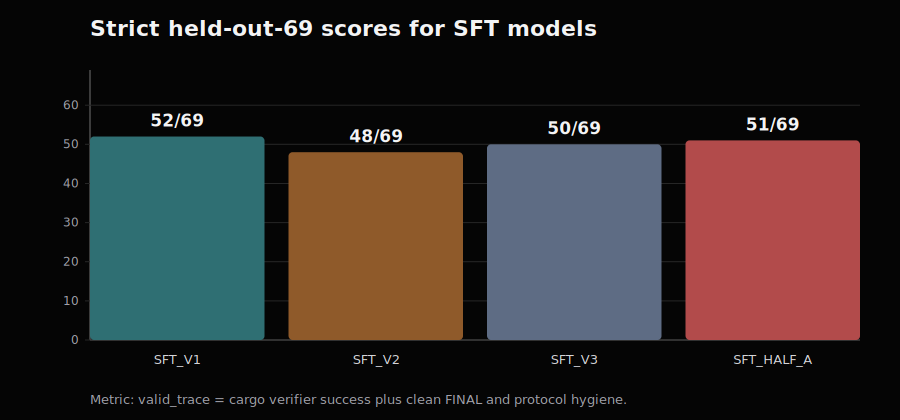
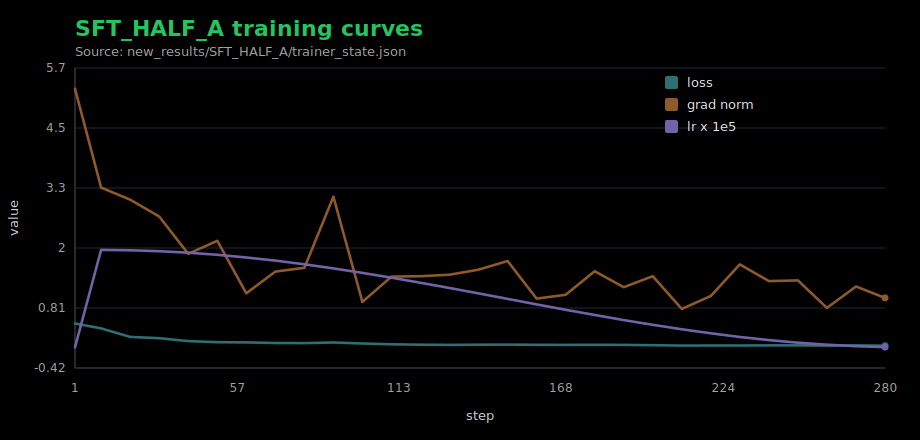
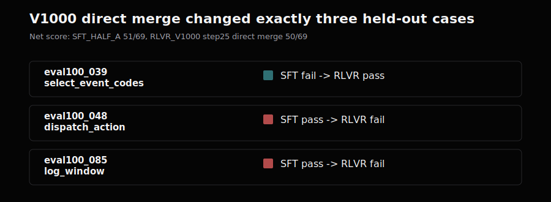
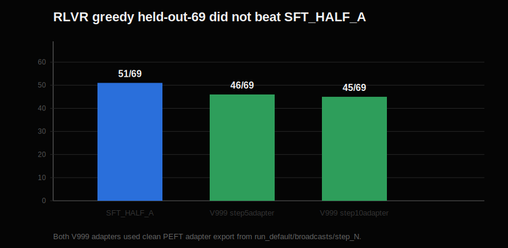
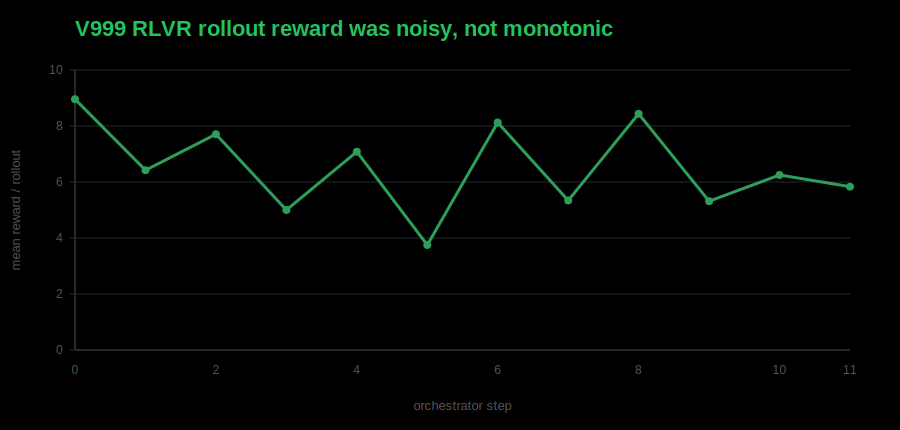
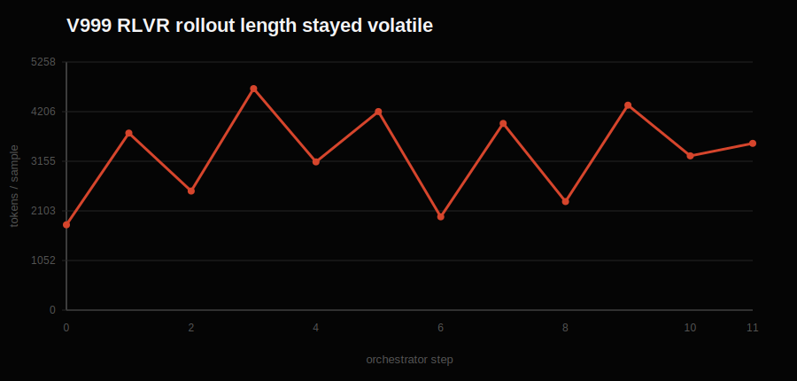

# SFT Worked. RLVR Showed One Hard Signal. The Contract Was the Real Lesson.

This is where I am ending this round of Glyph.

Glyph is a Rust tool-use agent. The model emits `CALL tool(...)` blocks, the
tools execute against real Rust crates, and then the model is supposed to stop
with a clean `FINAL`.

The contract is not just "make cargo pass." The contract is the whole trace:

```text
CALL read_file(...)
RESULT ...
CALL apply_patch(...)
RESULT ...
CALL cargo_test(...) or CALL cargo_run(...)
RESULT status: success
FINAL: ...
```

That is the core lesson:

```text
Verifier RL is only as real as the contract it is optimizing.
For tool-use agents, the contract is the whole trace, not just the verifier.
```

The experiment was simple: take a strong SFT model and see whether verifier RL
can improve it on a held-out Rust tool-use eval.

The final result:

```text
SFT built the agent.
RLVR produced one real held-out signal: a strict solve that SFT missed.
RLVR did not improve aggregate held-out reliability.
Most apparent RL collapses were infrastructure mismatches until proven otherwise.
```

That is not the clean RLVR result I wanted, but it is the result I trust.

## The Metric Had To Be the Whole Trace

Early scoring was too loose. A metric called `terminal_tool_success` could give
credit when the last successful tool was something like `read_file`. That is not
a coding-agent success.

The metric that mattered became strict `valid_trace`:

```text
valid_trace =
  terminal cargo_test or cargo_run success
  + clean FINAL after that verifier success
  + exact CALL syntax
  + no role-marker leakage
  + no repetition or gibberish
  + no extra tool use after successful verification
```

If the model passes tests but keeps patching, emits malformed calls, leaks
ChatML markers, or never finalizes, it is not a usable tool-use agent.

## SFT Was the Main Result

The first strong SFT model, `SFT_V1`, scored:

```text
SFT_V1 strict held-out-69: 52/69
```

That was the first real artifact: a 4B base model learned the
CALL/RESULT/FINAL protocol well enough to edit Rust projects, run real cargo
verifiers, and solve most of the held-out set.

Then I tried deeper SFT data. `SFT_V2` added variable-depth recovery.
`SFT_V3` added deeper recovery plus oversampled clean PASS -> FINAL traces.



```text
SFT_V1:     52/69
SFT_V2:     48/69
SFT_V3:     50/69
SFT_HALF_A: 51/69
```

The broad held-out score did not improve. But on the original 17 held-out
problems that `SFT_V1` failed:

```text
SFT_V1: 0/17
SFT_V2: 4/17
SFT_V3: 5/17
```

That was the first important tradeoff. Deeper recovery data added hard-tail
capability, but it disturbed broad reliability. More difficult traces were not
automatically better. They shifted the policy.

The clean `SFT_HALF_A` run looked normal:



So RLVR was not starting from a broken baseline. It was starting from a
competent SFT policy.

## The Clean Split

To make the RLVR experiment fair, I split `synthetic_data/signal_v3.jsonl` into
two deterministic halves:

```text
SFT_HALF_A: 1,042 rows, 762 unique case_ids
RL_POOL_B:  1,041 rows, 760 unique case_ids
```

The split preserved family, difficulty, expected tool-sequence length, and
run-vs-test balance as much as possible. It was grouped by `case_id`, so
oversampled traces for the same case could not land on both sides.

Leakage checks:

```text
case_id overlap: 0
trace overlap:   0
```

`SFT_HALF_A` trained only on half A and scored:

```text
SFT_HALF_A strict held-out-69: 51/69
```

That became the baseline. A real RLVR improvement needed to beat `51/69` on the
same strict held-out eval.

## The Harness Was the Experiment

Several RLVR attempts failed before the final clean readout.

Full-finetune RLVR was too destructive. Tiny target-set LoRA was basically
flat. Larger `RL_POOL_B` LoRA runs looked promising enough to debug seriously,
but the first scary regressions were not all model failures. They were harness
failures.

The same underlying lesson showed up three ways:

```text
RL reward must match held-out success.
RL rendering must match the SFT/eval tool protocol.
RL checkpoint export must match the policy actually served during training.
```

Reward first: cargo passing somewhere in the trace is not enough. The top
reward had to mean held-out-style success: terminal verifier pass, exact CALL
syntax, clean final, no role leakage, no repetition, and no extra tool use after
success.

Protocol next: the model was trained on literal ChatML-style tool turns:

```text
<|im_start|>assistant
CALL ...
<|im_end|>
<|im_start|>tool
RESULT ...
<|im_end|>
```

Any deviation is not formatting trivia. It changes the learned task.

Export was the nastiest one. Two checkpoints appeared to collapse to `0/69`,
but the traces were not random. They had one extra parenthesis:

```text
CALL read_file(id="c1", file_path="..."))
```

Strict eval rejected every malformed call, no tools ran, and the score went to
zero. That looked like RL destroyed the model. It had not. The bad repos came
from non-canonical full-weight export paths. The policy served during RL was
base model plus the broadcast LoRA adapter; the trainer's `weights/step_N`
directory was not the clean served policy.

The official path became:

```text
outputs/<RUN>/run_default/broadcasts/step_N/
```

exported as a PEFT adapter and evaluated as:

```bash
python -m sft.eval_formal \
  --sft-model JayZenith/SFT_HALF_A \
  --sft-adapter JayZenith/<RLVR_ADAPTER_REPO> \
  ...
```

Only after those fixes did the RLVR result become worth interpreting.

## The One Real RLVR Signal

The cleanest case-level RLVR signal is `RLVR_V1000` step 25, evaluated through a
direct local merge of the broadcast adapter:

```text
SFT_HALF_A:                         51/69
RLVR_V1000 step25 direct merge:     50/69
```

So it did not improve overall.

But it did solve one held-out problem that `SFT_HALF_A` failed:



The case:

```text
eval100_039_select_event_codes_partial_then_full_fix
kind: patch_test_recover
```

`SFT_HALF_A` got stuck in a repeated read -> patch -> test loop. It made 21
tool calls, never got the tests to pass, exhausted the budget, and emitted no
clean final.

`RLVR_V1000` made a better fourth patch, got `cargo_test` passing at call
`c12`, and emitted a clean one-line `FINAL`.

That is a real strict held-out solve. It is not lenient scoring and not an
export artifact. But it is only a signal, because the same checkpoint regressed
two cases that SFT solved:

```text
eval100_048_dispatch_action_match_branch_repair
eval100_085_log_window_filter_map_recover
```

The honest claim is:

```text
RLVR showed one case-level recovery signal absent from SFT greedy behavior,
while aggregate reliability regressed by one.
```

That is not a win. It is a signal that needs verification and regression
control.

## The Final Clean RLVR Run Still Regressed

After fixing reward shape, protocol fidelity, strict parser behavior, and
adapter export, I ran the cleaner V3000-style LoRA path.



```text
SFT_HALF_A:            51/69
V3000 step 5 adapter:  44/69
V3000 step 10 adapter: 47/69
V3000 step 15 adapter: 43/69
```

Step 10 was the best checked V3000 checkpoint, but it was still below the
baseline.

The RL curves explain why I do not want to overread that run. Reward bounced
around rather than showing clean improvement:



Sequence length stayed volatile too:



For this task, longer rollouts often mean recovery grind, not better behavior.
A reward spike inside RL only matters if it transfers to strict held-out
`valid_trace`. Here it did not.

## What I Think Happened

SFT gave the model a strong prior for the exact tool protocol and a decent
greedy repair strategy.

RLVR perturbed that policy enough to change recovery trajectories. Sometimes
that helped. The V1000 case-level signal is evidence of that.

But the same perturbation broke other recoveries. The model was not learning a
broadly better repair policy. It was reshuffling near-boundary greedy paths.

The best interpretation:

```text
RLVR found a real capability movement, not a reliable improvement.
```

If I kept going, I would not run more blind RL on the full pool. I would filter
for signal:

```text
1. Run pass@k on RL_POOL_B with the SFT model.
2. Keep prompts with mixed outcomes under the same eval budget.
3. Drop always-solved and always-failed prompts.
4. Train with frequent greedy canaries.
5. Stop as soon as held-out valid_trace degrades.
```

The missing ingredient is probably not more compute. It is cleaner RL signal
selection and tighter regression control.

## Where This Ends

The final readout:

```text
SFT is the main result.
Strict evals are non-negotiable.
RLVR produced one hard held-out signal.
RLVR did not improve aggregate reliability.
Most apparent RL collapse was harness, reward, protocol, or export mismatch
until those paths were audited.
```

I wanted a simple RLVR result. The useful finding is sharper:

```text
Verifier RL is only as real as the contract it is optimizing.
For tool-use agents, the contract is the whole trace, not just the verifier.
```
