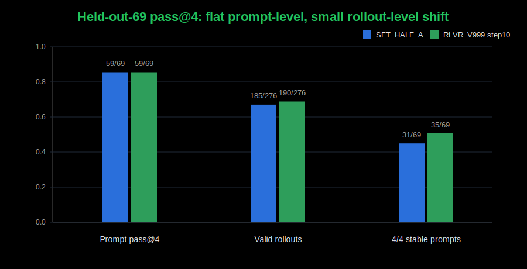

# SFT Worked. RLVR Moved the Distribution, But Did Not Win.

This is where I am ending this round of Glyph.

Glyph is a Rust tool-use agent. The model emits `CALL tool(...)` blocks, tools
execute against real Rust crates, and then the model should stop with a clean
`FINAL`.

The contract is not just "make cargo pass." The contract is the whole trace:

```text
CALL read_file(...)
RESULT ...
CALL apply_patch(...)
RESULT ...
CALL cargo_test(...) or CALL cargo_run(...)
RESULT status: success
FINAL: ...
```

That is the core lesson:

```text
Verifier RL is only as real as the contract it is optimizing.
For tool-use agents, the contract is the whole trace, not just the verifier.
```

The result is not the RLVR win I wanted. SFT built the agent. RLVR changed the
sampled distribution, but did not improve held-out prompt-level reliability.

## The Metric Had To Be the Whole Trace

Early scoring was too loose. A metric called `terminal_tool_success` could
credit a trace whose last successful tool was not a verifier. That is not a
coding-agent success.

The metric that mattered became strict `valid_trace`:

```text
valid_trace =
  terminal cargo_test or cargo_run success
  + clean FINAL after that verifier success
  + exact CALL syntax
  + no role-marker leakage
  + no repetition or gibberish
  + no extra tool use after successful verification
```

If the model passes tests but keeps patching, emits malformed calls, leaks role
markers, or never finalizes, it is not a usable tool-use agent.

## SFT Was the Main Result

The first strong SFT model, `SFT_V1`, scored:

```text
SFT_V1 strict held-out-69: 52/69
```

That was the real first artifact: a 4B base model learned the
CALL/RESULT/FINAL protocol well enough to edit Rust projects, run cargo
verifiers, and solve most of the held-out set.

Then I tried deeper SFT data. `SFT_V2` added variable-depth recovery. `SFT_V3`
added deeper recovery plus oversampled clean PASS -> FINAL traces.


```text
SFT_V1:     52/69
SFT_V2:     48/69
SFT_V3:     50/69
SFT_HALF_A: 51/69
```

The broad held-out score did not improve. But on the original 17 held-out
problems that `SFT_V1` failed:

```text
SFT_V1: 0/17
SFT_V2: 4/17
SFT_V3: 5/17
```

That was the first tradeoff. Deeper recovery data added hard-tail capability,
but disturbed broad reliability. More difficult traces were not automatically
better. They shifted the policy.

The clean `SFT_HALF_A` run looked normal:


So RLVR started from a competent SFT policy, not a broken baseline.

## The Clean Split

To make the RLVR experiment fair, I split `synthetic_data/signal_v3.jsonl` into
two deterministic halves:

```text
SFT_HALF_A: 1,042 rows, 762 unique case_ids
RL_POOL_B:  1,041 rows, 760 unique case_ids
```

The split was grouped by `case_id`, so oversampled traces for one case could not
land on both sides.

Leakage checks:

```text
case_id overlap: 0
trace overlap:   0
```

`SFT_HALF_A` trained only on half A and scored:

```text
SFT_HALF_A strict held-out-69: 51/69
```

That became the baseline. RLVR needed to beat `51/69` on the same strict
held-out eval.

## The Harness Was the Experiment

Several RLVR attempts failed before the final clean readout. I initially read
the full-finetune regression as destructive RL, but I no longer think that is a
clean conclusion. Those runs still had SFT/RLVR alignment problems: the reward,
chat/tool rendering, and export path were not yet enforcing the exact same
contract as the SFT data and held-out eval. Tiny target-set LoRA was basically
flat. Larger LoRA runs were worth debugging, but the first scary regressions
were not all model failures. They were harness failures.

The same lesson showed up three ways:

```text
RL reward must match held-out success.
RL rendering must match the SFT/eval tool protocol.
RL checkpoint export must match the policy actually served during training.
```

Reward first: cargo passing somewhere in the trace is not enough. Top reward
had to mean held-out-style success: terminal verifier pass, exact CALL syntax,
clean final, no role leakage, no repetition, and no tool use after success.

Protocol next: the model was trained on literal ChatML-style tool turns:

```text
<|im_start|>assistant
CALL ...
<|im_end|>
<|im_start|>tool
RESULT ...
<|im_end|>
```

Any deviation is not formatting trivia. It changes the learned task.

Export was the nastiest one. Two checkpoints appeared to collapse to `0/69`,
but the traces were not random. They had one extra parenthesis:

```text
CALL read_file(id="c1", file_path="..."))
```

Strict eval rejected every malformed call, no tools ran, and the score went to
zero. That looked like RL destroyed the model. It had not. The bad repos came
from non-canonical full-weight exports. The served RL policy was base model plus
the broadcast LoRA adapter; `weights/step_N` was not the clean served policy.

The official path became:

```text
outputs/<RUN>/run_default/broadcasts/step_N/
```

exported as a PEFT adapter and evaluated as:

```bash
python -m sft.eval_formal \
  --sft-model JayZenith/SFT_HALF_A \
  --sft-adapter JayZenith/<RLVR_ADAPTER_REPO> \
  ...
```

Only after those fixes did the RLVR result become worth interpreting.

## One Held-Out Signal

The cleanest early case-level RLVR readout was `RLVR_V1000` step 25, evaluated
through a direct local merge of the broadcast adapter:

```text
SFT_HALF_A:                     51/69
RLVR_V1000 step25 direct merge: 50/69
```

So it did not improve overall.

But it did solve one held-out problem that `SFT_HALF_A` failed:


This case matters because it is exactly the kind of recovery loop SFT still
struggled with: repeated plausible patches, real verifier feedback, and a
budget that disappears if the model does not converge.

The case:

```text
eval100_039_select_event_codes_partial_then_full_fix
kind: patch_test_recover
```

`SFT_HALF_A` got stuck in a repeated read -> patch -> test loop. It made 21
tool calls, never passed the tests, exhausted the budget, and emitted no clean
final.

`RLVR_V1000` made a better fourth patch, got `cargo_test` passing at call `c12`,
and emitted a clean one-line `FINAL`.

That is a real strict held-out solve. It is not lenient scoring or an export
artifact. But the same checkpoint regressed two cases that SFT solved:

```text
eval100_048_dispatch_action_match_branch_repair
eval100_085_log_window_filter_map_recover
```

The gain and losses looked symmetric: near-boundary recovery loops where a
slightly perturbed greedy trajectory diverged early and either converged or did
not.

The honest claim was:

```text
RLVR changed which recovery loops converge under greedy decoding,
while aggregate reliability regressed by one.
```

## The Final pass@4 Check

The cheap decisive check was held-out-69 pass@4 with the final clean adapter
path: `SFT_HALF_A` versus `SFT_HALF_A + RLVR_V999_STEP10`, same prompts, same
tool budget, same temperature, real cargo execution, separate sandbox per
rollout.



The result:

```text
SFT_HALF_A valid pass@4 prompts:       59/69
RLVR_V999_STEP10 valid pass@4 prompts: 59/69

SFT_HALF_A valid rollouts:             185/276
RLVR_V999_STEP10 valid rollouts:       190/276

SFT_HALF_A 4/4 stable prompts:         31/69
RLVR_V999_STEP10 4/4 stable prompts:   35/69
```

Prompt-level gains where SFT had zero valid samples and RLVR had at least one:

```text
eval100_014_layered_config_env_does_not_override_explicit_file: 0/4 -> 2/4
eval100_035_record_line_parse_validate_recover:                 0/4 -> 1/4
eval100_039_select_event_codes_partial_then_full_fix:            0/4 -> 1/4
```

Prompt-level losses:

```text
eval100_037_weekly_region_summary_recover:             2/4 -> 0/4
eval100_097_department_expense_summary_report:          1/4 -> 0/4
eval100_099_filter_map_inventory_restock_report:        1/4 -> 0/4
```

The original V1000 signal case, `eval100_039`, did show up again:

```text
SFT_HALF_A:        0/4
RLVR_V999_STEP10: 1/4
```

But the aggregate prompt-level result was flat. RLVR increased valid rollout
count by five and made four more prompts stable at 4/4, while losing three
prompt-level pass@4 cases. And the rollout-level shift does not clear the noise
floor: at a ~68% success rate, one standard deviation on 276 rollouts is about
8, so +5 is statistically indistinguishable from zero. That is not a win. It is
not even a claimable signal.

The one effect that did reproduce is negative. The two run_only losses
(`eval100_097`, `eval100_099`) kept cargo passing 4/4 while validity fell to
0/4: the policy drifted into copying multiline stdout into `FINAL`, failing
hygiene. The same five run_only cases failed greedy at both step 5 and step 10.
The mechanism is pool composition: run_only and test_only prompts are about 6%
of the RL pool, so almost no training groups exist where the reward can punish
that drift. Nothing in training defends behavior it never samples.

## Decomposing the Loss: Solving vs Finalizing

Scoring the same greedy traces on cargo verifier success alone separates the
two:

```text
                greedy cargo solved    greedy valid_trace
SFT_HALF_A:     51/69                  51/69
V999 step 5:    51/69                  46/69
V999 step 10:   50/69                  45/69
```

RLVR did not degrade Rust solving at all. The entire strict regression is
final-answer hygiene, concentrated in the run_only drift above. Cargo-only
pass@4 even ticked up (60/69 -> 62/69 prompts, 203 -> 205 rollouts), but that
sits inside the same noise floor as everything else, so it is not claimable
either.

This is not a reward-contract failure. The reward scored multiline-FINAL
successes exactly 0, verified across every rollout. It is a training-coverage
failure: the correct contract had almost no run_only groups to apply gradient
to, so unrelated drift in that region went undefended. The fix is data
balance, not reward design.

## The Final Clean RLVR Run Still Regressed Greedy

The final run had everything verified: a binary reward measured to emit exactly
0 or 10 (with 10 equal to strict held-out validity on every rollout checked), a
chat template byte-identical to the SFT/eval trace format with a launch-time
parity assertion, and the safe adapter export path. The adapter checkpoints
still lost on greedy held-out eval:


```text
SFT_HALF_A:             51/69
RLVR_V999 step 5:       46/69
RLVR_V999 step 10:      45/69
```

The RLVR rollout curves did not tell a clean learning story either:


For this task, longer rollouts often mean recovery grind, not better behavior.
An RL reward spike only matters if it transfers to strict held-out
`valid_trace`. Here it did not.

## What I Think Happened

SFT gave the model a strong prior for the exact tool protocol and a decent
greedy repair strategy.

RLVR perturbed that policy enough to change recovery trajectories. Sometimes
that flipped a case in. Sometimes it flipped cases out. Under pass@4, the prompt
set stayed flat at `59/69`, but the sampled rollout count moved slightly upward.

There is also a structural mismatch worth naming: training optimizes the
temperature-0.8 sampling distribution, while the headline eval is greedy
decode. A policy can genuinely shift its sampled distribution while its argmax
path moves unpredictably -- which is exactly what checkpoint-to-checkpoint
churn in the greedy solved set looks like. On a 69-prompt greedy eval with a
noise floor of roughly plus or minus three cases, a true RL effect of one or
two cases is smaller than the instrument can resolve.

The model was not learning a broadly better repair policy. It was reshuffling
near-boundary paths. The final measurement says:

```text
RLVR produced case-level movement within the noise floor,
no held-out prompt-level improvement, and one reproducible
regression caused by training-pool kind imbalance.
```

## Where This Ends

The final readout:

```text
SFT is the main result.
Strict evals are non-negotiable.
RLVR's rollout-level gain was within sampling noise; prompt-level pass@4 was flat.
Greedy held-out performance regressed, partly from a diagnosed data-imbalance drift.
Most apparent RL collapse was harness, reward, protocol, or export mismatch,
not the policy.
```

I wanted a simple RLVR result. The useful finding is sharper:

```text
Verifier RL is only as real as the contract it is optimizing.
For tool-use agents, the contract is the whole trace, not just the verifier.
```
